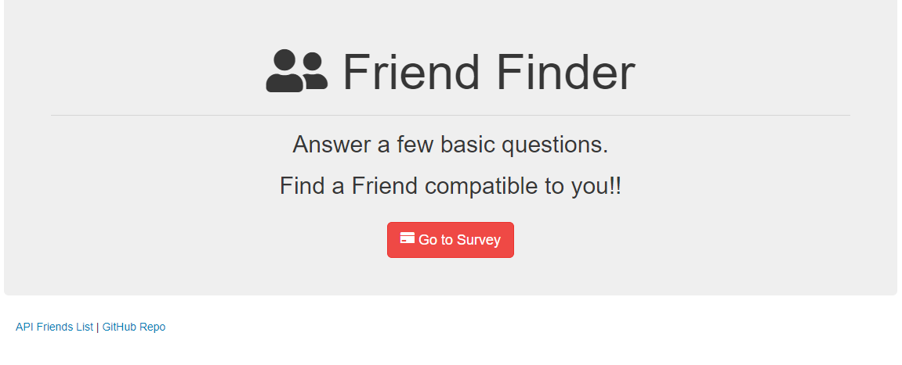
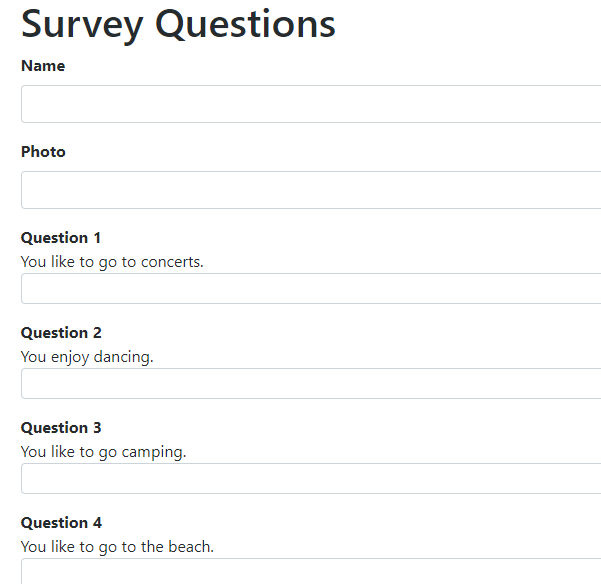

# FriendFinder

Do you need a friend. Use the friend finder to find someone to hang out with that is into the same things as you. Just fill out the simple survey of 10 questions and we will return a like-minded friend. 

Your data will also be stored so other people will be matched with you!!

## Getting Started
https://friend-finder-ed.herokuapp.com/

## Screen Shots


Home Page


Survey


New Friend Modal

## Technologies used
- Node.js
- express NPM Package - https://www.npmjs.com/package/express
- path NPM Package - https://www.npmjs.com/package/path

### Prerequisites

```
- Node.js - Download the latest version of Node https://nodejs.org/en/
- Bootstrap - Add CDN link to HTML 
```

## Built With

* Bootstrap
*AwesomeFont

## Authors

[Ed Beaudet](https://github.com/ebeaudet)
